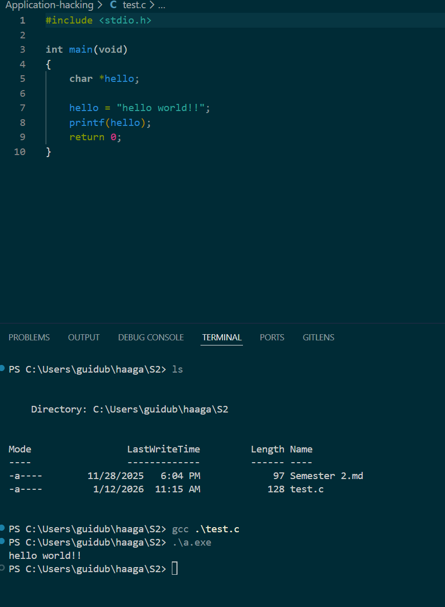
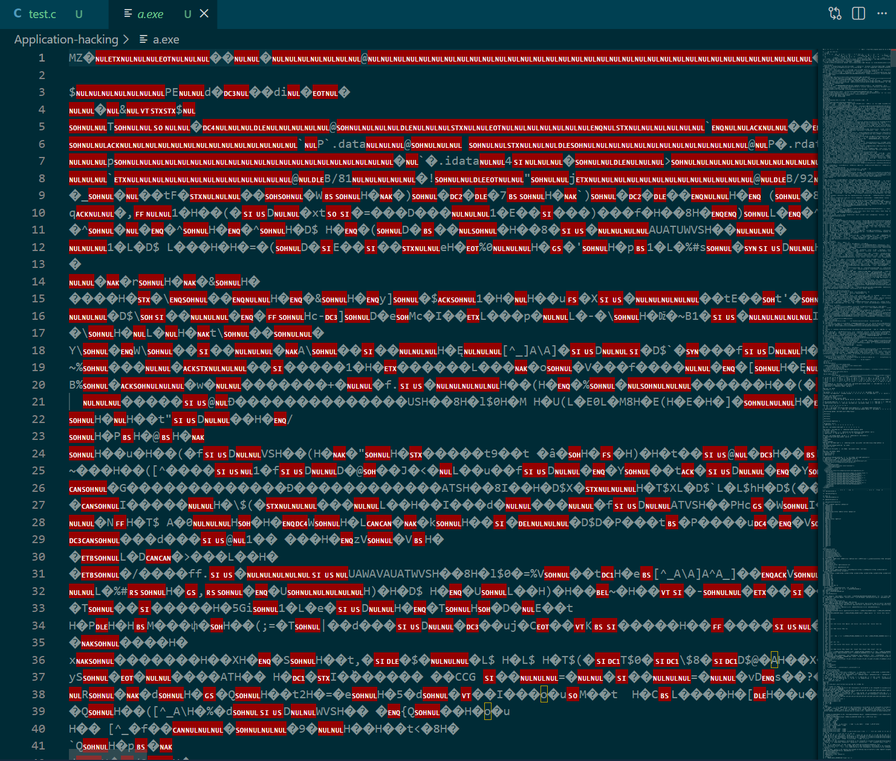

here i create a C file that print "hello world!!" and in the terminal i compiled it with GCC (the compiler of the C language) and execute it (gcc named the programe a.out or here in windows a.exe) and it print "hello world!!"

When you compile your code it create a file that is readable by the machine but not to us, like you can see bellow it looks like just a random generated file
