# x)
A01:2021 – Broken Access Control (OWASP)
- Most common OWASP Top 10 vulnerability.
- Found in ~94% of tested applications, with an average incidence rate of 3.81%.
- Over 318,000 occurrences in the dataset.
- Common related CWEs include:
    - CWE-200: Exposure of Sensitive Information to an Unauthorized Actor
    - CWE-201: Insertion of Sensitive Information Into Sent Data
    - CWE-352: Cross-Site Request Forgery
    - 
**Common Access Control Failures**
- No deny-by-default or violation of least privilege.
- URL manipulation or force browsing to access protected pages.
- Insecure Direct Object References (IDOR), accessing other users’ data via identifiers.
- Missing access checks on API methods (POST, PUT, DELETE).
- Vertical privilege escalation, user acts as admin or without authentication.
- Horizontal privilege escalation, user accesses other users’ resources.
- Token or metadata tampering (JWTs, cookies, hidden fields).
- CORS misconfiguration allowing untrusted origins.
- Access to authenticated or admin pages without proper checks.

# a)

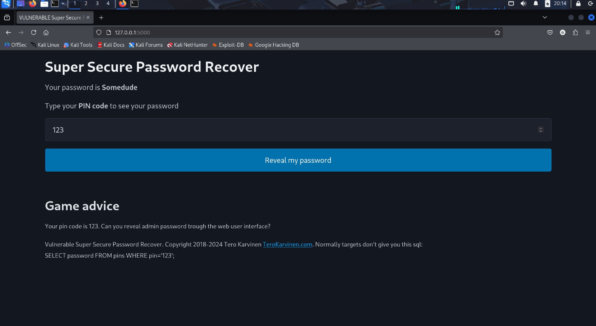
we are at the home page where we can enter "only" a number

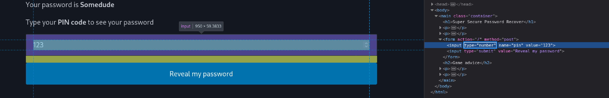
but it's because there is the "Type=number", we can inspect the page and removed it

now that i removed the type i can put something like " 'OR 1=1;-- " to get the "foo" password

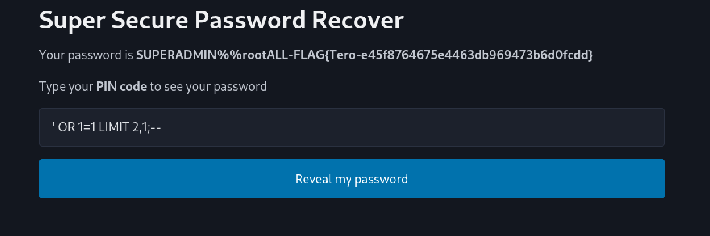
and by playing with the limit so that we can see other password we can get the flag 
# b)

since we only have a client side with only html i don't think there is a good way to solve it but there are way to hide it 
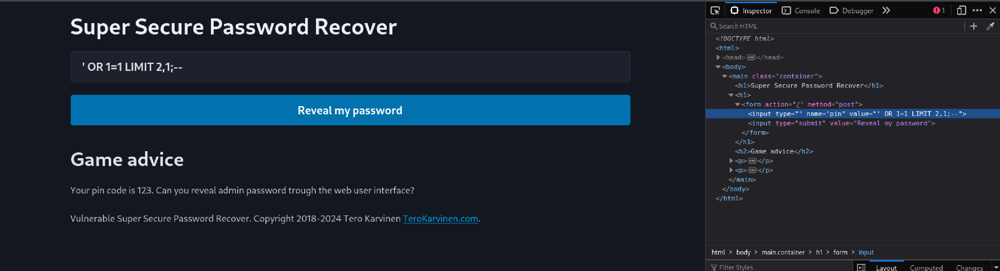

now it's just a web site where you put your id but there is no password recover because it's just a bad way to try to recover your account (changing your password is better)

# c)

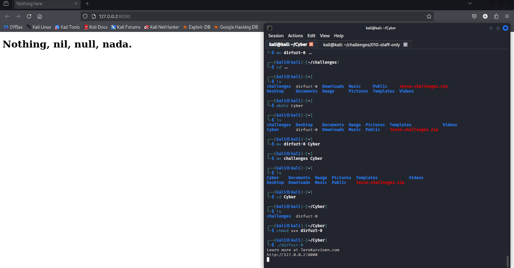
is this exercise we arrive in this page.
In those cases i like to test for pages before using tools...
in this case i wanted to test: robot, portal, login, admin...
and i was right with admin.... 
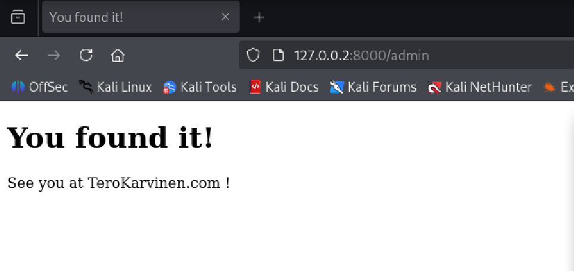
since the next exercise is going to uses some Fuzz tools i will show the usage after
# d)

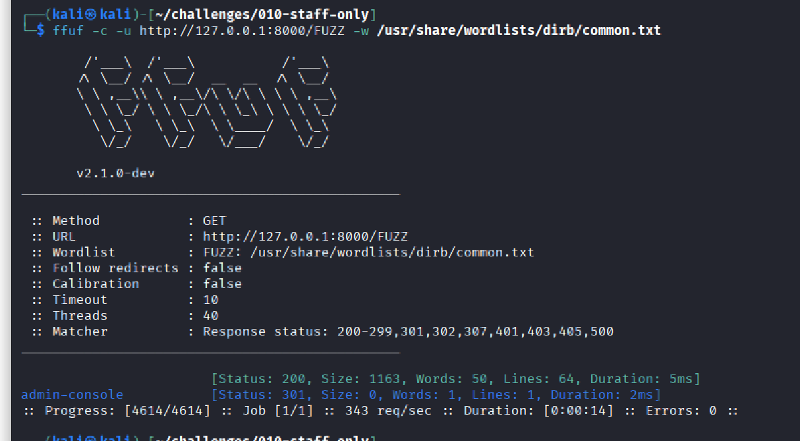
via ffuf we found that there is an admin-console page

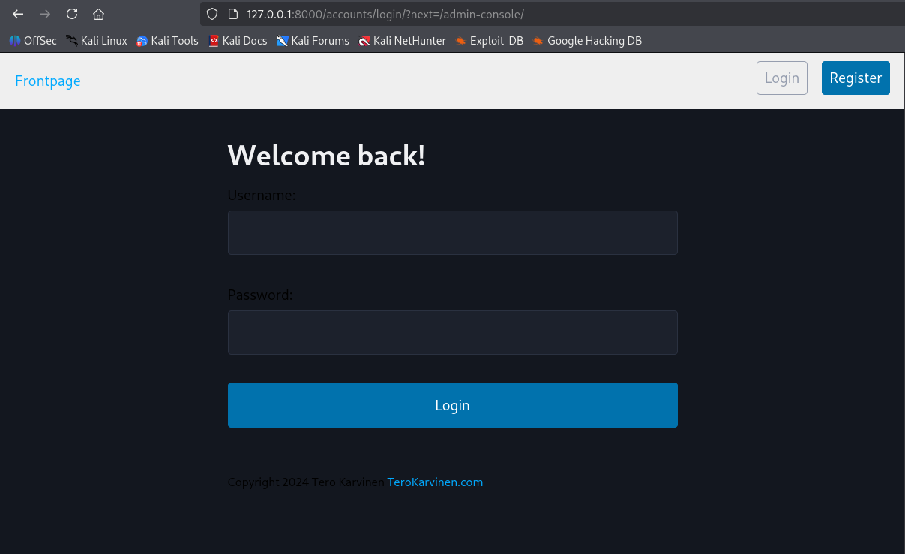
but we can see that it goes to a login page
since i don't know if the permission are right i decided to just create a "admin" account
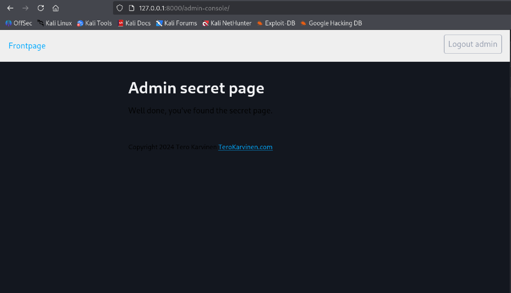
after register and login i retry the "admin-console" page and it work directly

it was fun it was the first time i used FFUF  even if i heard of it before, i am more familiar with gobuster and ferobuster so it's cool to learn how to used new tools

# e)

after many research in the code i found this :

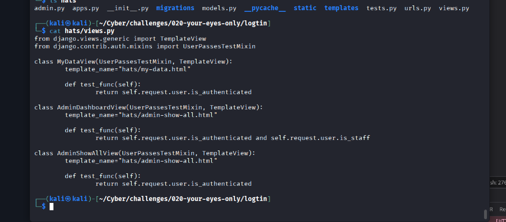

so i modified the test_func in the AdminShowAllView class to verified if the user is staff
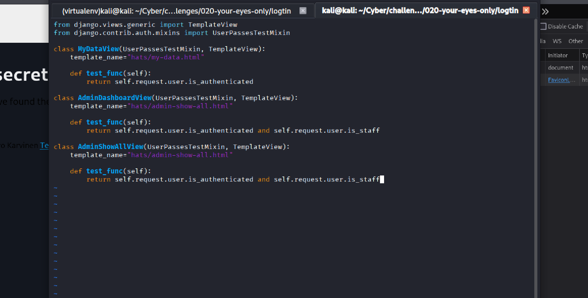

So now :
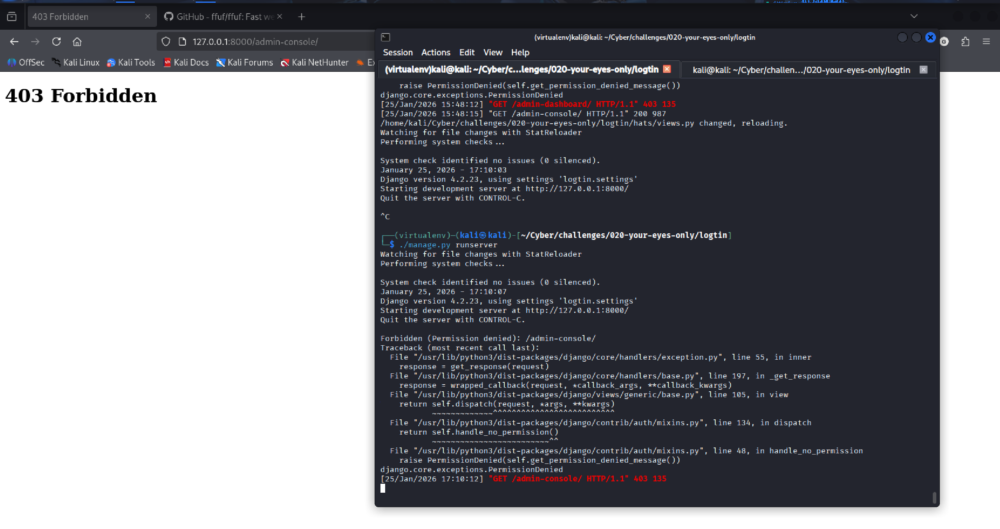

i cannot enter the admin console even when connected
