# a)
To get the .zip in my vm i use curl (wget work too) and unzip it with unzip
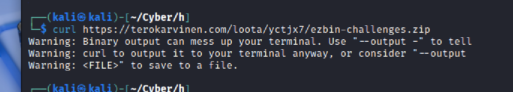
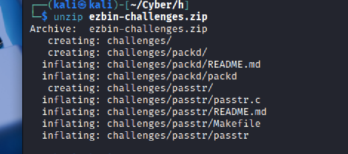
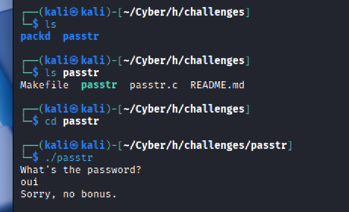
we use string to see whats going on in the executable
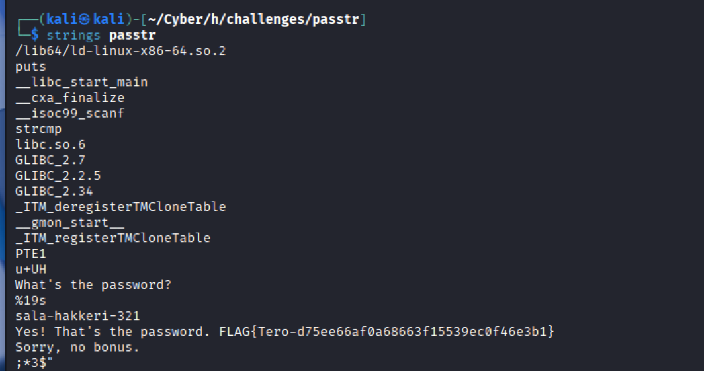

we can see the password  and the flag by looking at it
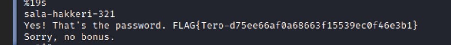
i have just verified that it is the password and it is
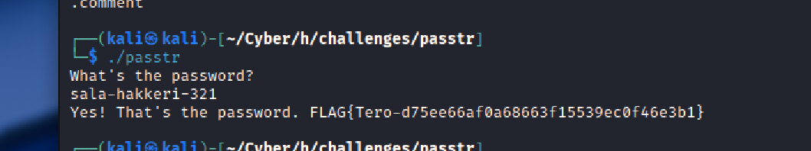
and so the flag is : FLAG{Tero-d75ee66af0a68663f15539ec0f46e3b1}
# b)

for obfuscate the password i just decompose the string in many little string 

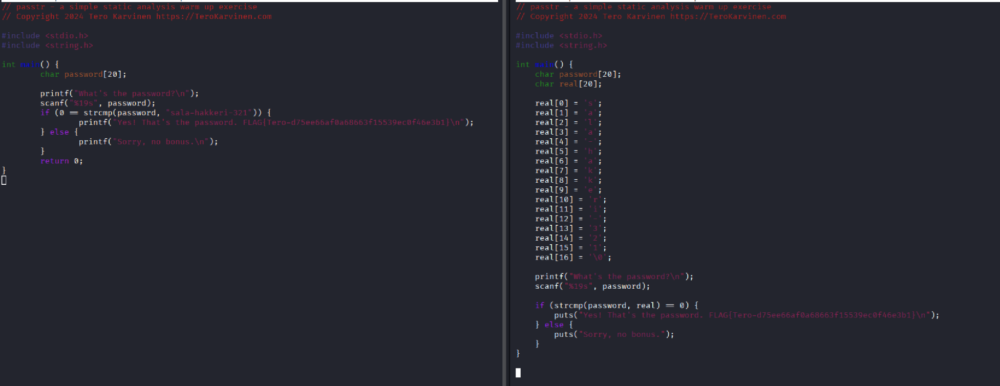

before :
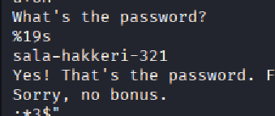

after : 
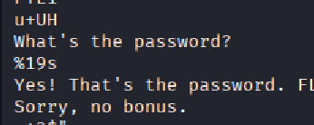
we can see that the password isn't visible now

# c)

now for the Packd we can see when we strings the file we see UPX so i just try to use upx in the terminal and i saw  that it was a command

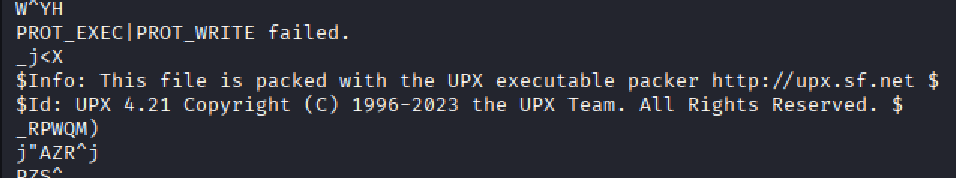

to see how it work i look at the the -h  and we see that -d decompress 

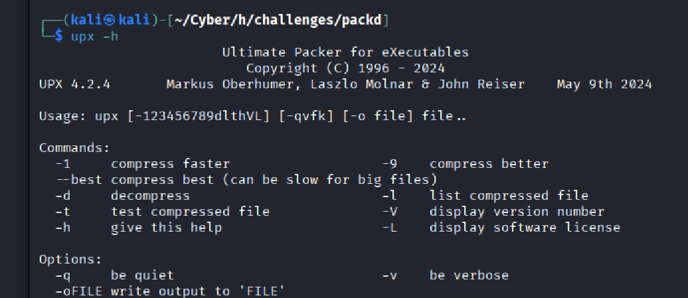

we can now  upx -d packd

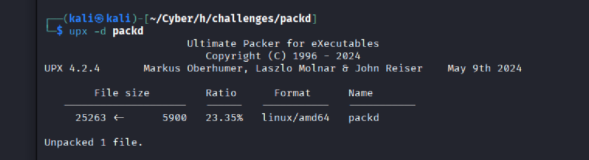

and now we can strings the file 
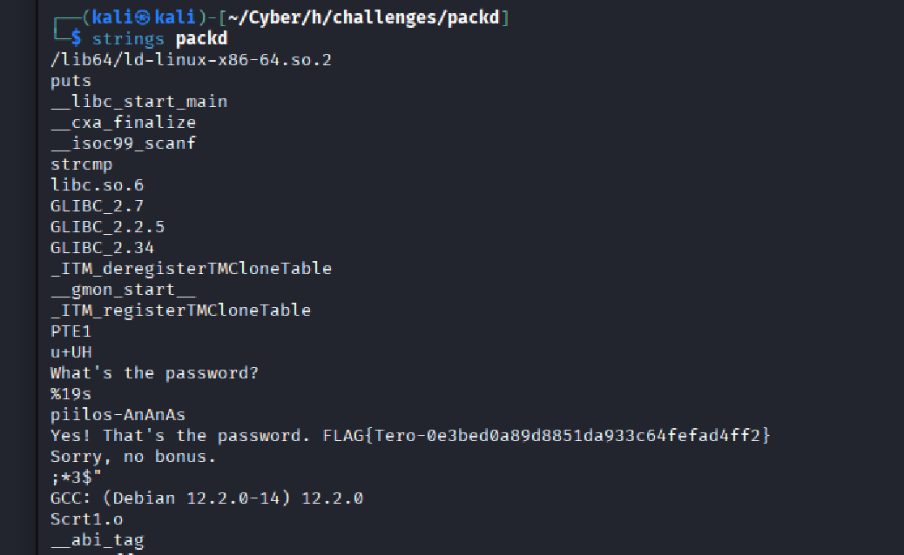
now we have the password and the flag
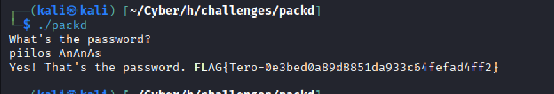
password : piilos-AnAnAs 
and the flag is FLAG{Tero-0e3bed0a89d8851da933c64fefad4ff2}