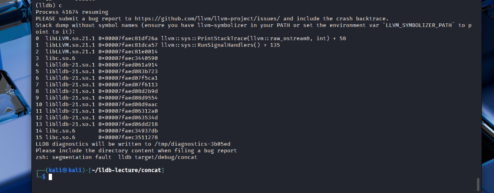
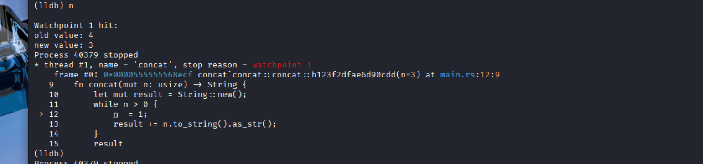
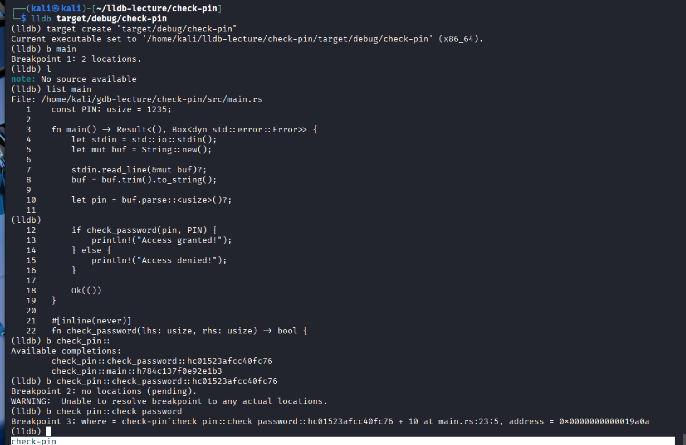
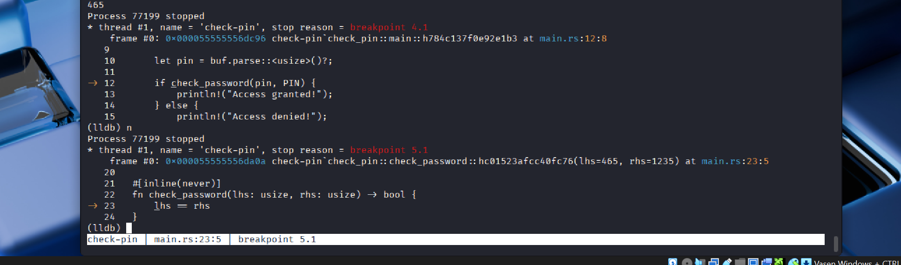
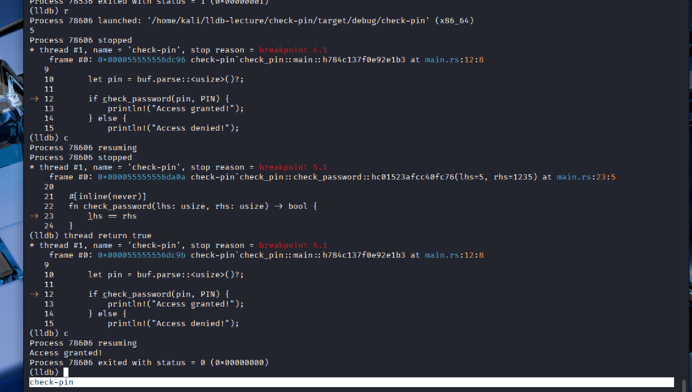

# LLDB

we have done some exercise in class with the GNU debugger 

i have never used LLDB in my life before so it was a little bit strange to use it (and i had some complication like show here)

but anyways in the concat function i manage to show a value change to see how it work

for the next one (check_pin)

i look at the file with the list function 
and put a breakpoint at the main function and the check_password one

when we arrive at the if we need to make it true

now we need to make it true... first i thought i can change the variable but i wasn't able to

but i saw that we can just return true and get that access granted

