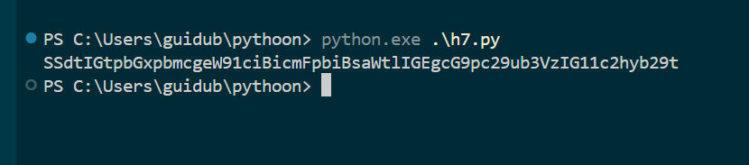
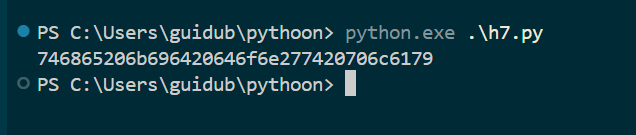
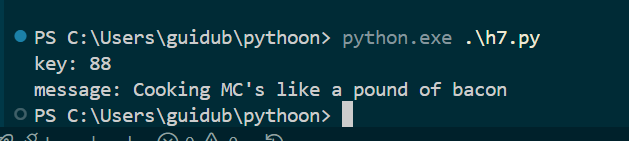
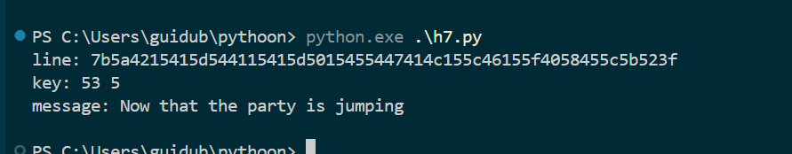

# X)

# A)

```py
import base64
import binascii

hex_string = "49276d206b696c6c696e6720796f757220627261696e206c696b65206120706f69736f6e6f7573206d757368726f6f6d"

result = base64.b64encode(binascii.unhexlify(hex_string))
print(result.decode())
```

# B)

```py
import binascii

a = "1c0111001f010100061a024b53535009181c"
b = "686974207468652062756c6c277320657965"

a_bytes = bytes.fromhex(a)
b_bytes = bytes.fromhex(b)

result = bytes(x ^ y for x, y in zip(a_bytes, b_bytes))

print(result.hex())
```

# C)

```py
import string

cipher_hex = "1b37373331363f78151b7f2b783431333d78397828372d363c78373e783a393b3736"
cipher = bytes.fromhex(cipher_hex)

def score(text):
    freq = " etaoinshrdlu"
    return sum(text.count(c) for c in freq)

best_score = 0
best_text = ""
best_key = None

for key in range(256):
    decoded = bytes(c ^ key for c in cipher)
    try:
        decoded_text = decoded.decode("ascii")
    except:
        continue

    s = score(decoded_text.lower())

    if s > best_score:
        best_score = s
        best_text = decoded_text
        best_key = key

print("key:", best_key)
print("message:", best_text)
```

# D)

```py
cipher_lines = open("data.txt").read().splitlines()

def score(text):
    freq = " etaoinshrdlu"
    return sum(text.count(c) for c in freq)

best_score = 0
best_message = ""
best_key = None
best_line = None

for line in cipher_lines:
    data = bytes.fromhex(line)

    for key in range(256):
        decoded = bytes(c ^ key for c in data)

        try:
            text = decoded.decode("ascii")
        except:
            continue

        s = score(text.lower())

        if s > best_score:
            best_score = s
            best_message = text
            best_key = key
            best_line = line

print("line:", best_line)
print("key:", best_key, chr(best_key))
print("message:", best_message)
```

